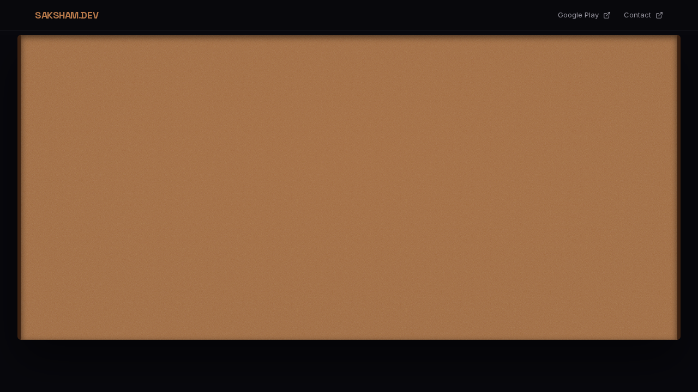

<div align="center">
  <h1>🚀 Saksham.Dev - Official Bulletin Board</h1>
  <p>
    <strong>The Official Developer Hub & Bulletin Board for Saksham Mogha.</strong><br/>
    Built with Next.js 14, Tailwind CSS, Framer Motion, and Supabase.
  </p>

  [](https://nextjs.org/)
  [](https://tailwindcss.com/)
  [](https://www.framer.com/motion/)
  [](https://supabase.com/)
</div>

<br />

## 📸 Sneak Peek

Here is a glimpse of the beautiful 3D interactive Bulletin Board in action!



### 🎥 Live Demo
Watch the video demo of the interactions below:

https://github.com/user-attachments/assets/demo-video-link-placeholder
*(Alternatively, check the `public/media/demo.webm` file in this repository)*

---

## 🌟 Features

- **Interactive 3D Bulletin Board:** A stunning UI crafted with CSS 3D transforms, custom cork textures, and realistic lighting to simulate a physical notice board.
- **Dynamic Notice Cards:** Each card comes with unique seed-based randomized tilting and Framer Motion spring animations for an organic feel.
- **Admin Dashboard:** Secure backend to publish, update, and manage app updates, releases, and roadmap notices.
- **Basic Authentication:** Built-in middleware-based authentication for the `/admin` routes.
- **Responsive & Accessible:** Fully responsive design from mobile (bottom-sheet modals for cards) to 4K desktop screens.
- **SEO Optimized:** Metadata, OpenGraph tags, and semantic HTML to ensure maximum visibility for app updates.

---

## 🛠 Tech Stack

- **Framework:** [Next.js 14](https://nextjs.org/) (App Router, Server Actions)
- **Styling:** [Tailwind CSS](https://tailwindcss.com/)
- **Animations:** [Framer Motion](https://www.framer.com/motion/)
- **Database:** [Supabase](https://supabase.com/) (PostgreSQL)
- **Icons:** [Lucide React](https://lucide.dev/)
- **Fonts:** Geist, Inter, Space Grotesk, JetBrains Mono

---

## 🚀 Getting Started

### Prerequisites

Make sure you have [Node.js](https://nodejs.org/) (v18 or higher) and npm/yarn/pnpm installed.

### 1. Clone the repository

```bash
git clone https://github.com/yourusername/saksham-dev-board.git
cd saksham-dev-board
```

### 2. Install Dependencies

```bash
npm install
# or
yarn install
# or
pnpm install
```

### 3. Environment Variables

Create a `.env.local` file in the root directory and add the following variables. You will need a Supabase project and credentials.

```env
# Supabase Configuration
NEXT_PUBLIC_SUPABASE_URL=your_supabase_project_url
NEXT_PUBLIC_SUPABASE_ANON_KEY=your_supabase_anon_key

# Admin Panel Authentication
ADMIN_PASSWORD=your_secure_admin_password
```

### 4. Database Setup (Supabase)

Create a table named `notices` in your Supabase database with the following schema:
- `id` (uuid, primary key)
- `title` (text)
- `description` (text)
- `type` (text: 'release', 'update', 'bugfix', 'roadmap', 'support')
- `app_name` (text, optional)
- `version` (text, optional)
- `date` (timestamp)
- `status` (text: 'published', 'draft')

### 5. Run the Development Server

```bash
npm run dev
```

Open [http://localhost:3000](http://localhost:3000) with your browser to see the result. The admin panel is available at [http://localhost:3000/admin](http://localhost:3000/admin).

---

## 📁 Project Structure

```
├── public/                 # Static assets and media
├── src/
│   ├── app/                # Next.js App Router pages
│   │   ├── admin/          # Secure Admin Panel
│   │   ├── fonts/          # Custom Fonts
│   │   └── page.tsx        # Main Landing Page
│   ├── components/         # Reusable React components
│   │   ├── BoardCard.tsx   # Individual Notice Card
│   │   ├── BulletinBoard.tsx # Main 3D Board UI
│   │   ├── Nav.tsx         # Navigation Bar
│   │   └── Footer.tsx      # Site Footer
│   ├── lib/                # Utility functions and Supabase client
│   └── types/              # TypeScript definitions
├── middleware.ts           # Next.js Middleware (Auth)
└── tailwind.config.ts      # Tailwind CSS configuration
```

---

## 🤝 Contributing

Contributions, issues, and feature requests are welcome!
Feel free to check [issues page](https://github.com/yourusername/saksham-dev-board/issues).

---

## 📝 License

This project is open-source and available under the [MIT License](LICENSE).

<div align="center">
  <p>Built with ❤️ by Saksham Mogha</p>
</div>
